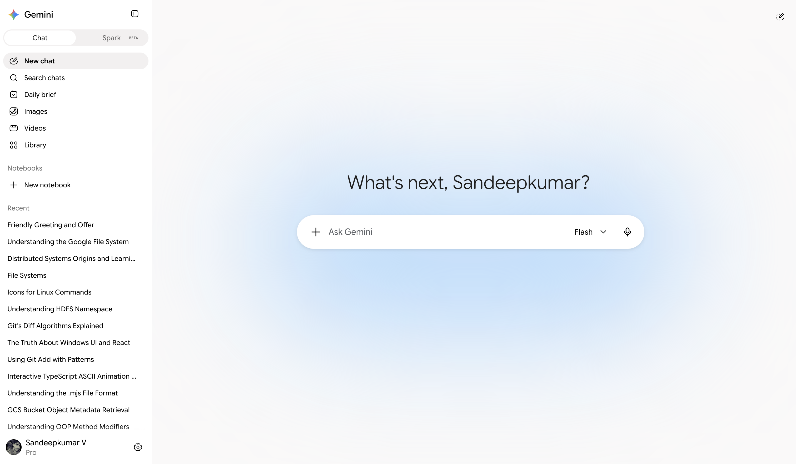
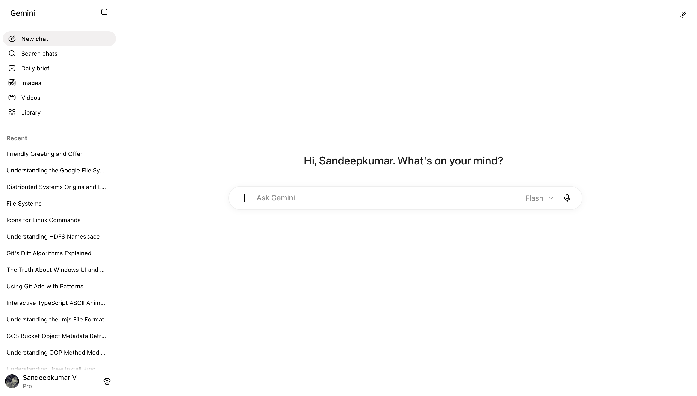
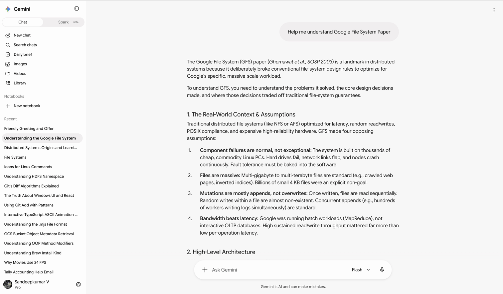

# Stripped down Gemini app for cleaner UI/UX

## App UI

| Before UI script changes | After UI script changes |
| --- | --- |
|  |  |

## Conversation UI Difference

## Setup

1. Install [Stylus](https://chromewebstore.google.com/detail/stylus/clngdbkpkpeebahjckkjfobafhncgmne) and [Tampermonkey](https://chromewebstore.google.com/detail/tampermonkey/dhdgffkkebhmkfjojejmpbldmpobfkfo) from the Chrome Web Store.
2. In Stylus, create a new UserCSS style, paste the contents of [`neo-gemini-theme.user.css`](neo-gemini-theme.user.css), and save it.
3. In Tampermonkey, create a new userscript, replace its contents with [`gemini-composer-sizing.user.js`](gemini-composer-sizing.user.js), and save it.
4. Open `chrome://extensions`, select **Details** for Tampermonkey, and enable **Allow User Scripts**.
5. Make sure both extensions are enabled, then reload [Gemini](https://gemini.google.com/).

Disable the Stylus style and Tampermonkey userscript to restore Gemini's original interface.

## Disclaimer

This project is a personal, local interface customization created only to improve readability and comfort. 

It applies CSS in the browser and uses a local helper to size the text composer, it is not intended to modify Gemini's code, bypass controls, scrape content, automate requests, or interfere with Google services. Gemini and related marks belong to Google.

With that being said, would be happy to take down if prompted! Reach out to https://x.com/sandeepvsk10

Thanks
